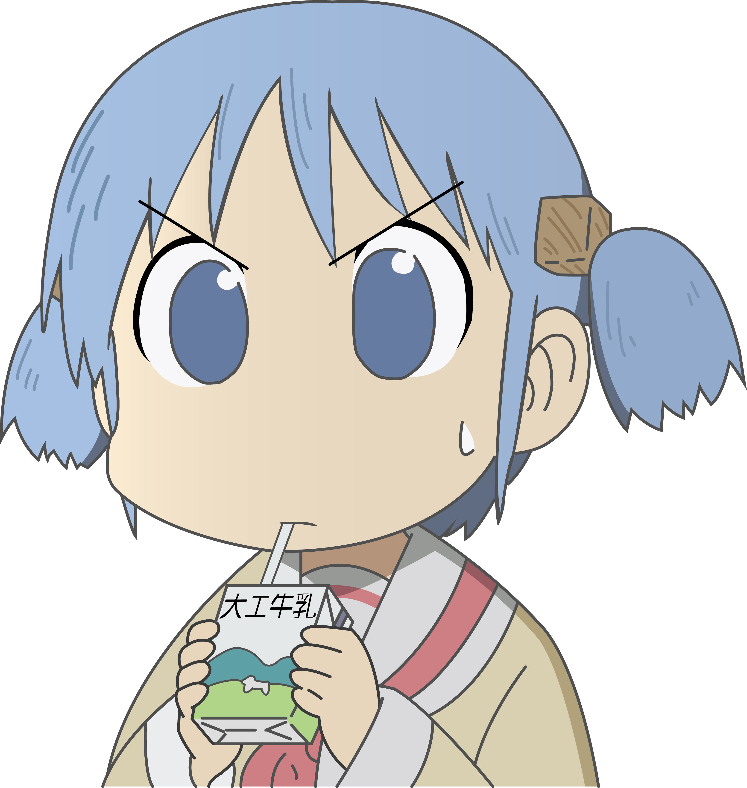

终于有人来看咱了呢qwq

### 关于我 / About me
- 菜鸡前端开发，没啥特长，面向大模型编程
- TypeScirpt 体操练习生，练习时长两年半
- 已经失去了很大一部分创造力和想象力

### 没事干嘛 / Mainly coding on
- [折腾自己小站 / My Blog](https://github.com/Mahoo12138/blog-with-next)
- [折腾自部署服务 / Selfhosted App](https://github.com/awesome-selfhosted/awesome-selfhosted)

### 联系方式 / Contact me
- Email mahoo12138@qq.com
- Twitter / X [@mahoo12138](https://x.com/mahoo12138)
- QQ 930814673

### 可能会的 / My Skills

 

 
 
 
 
 
 
 
 
 
